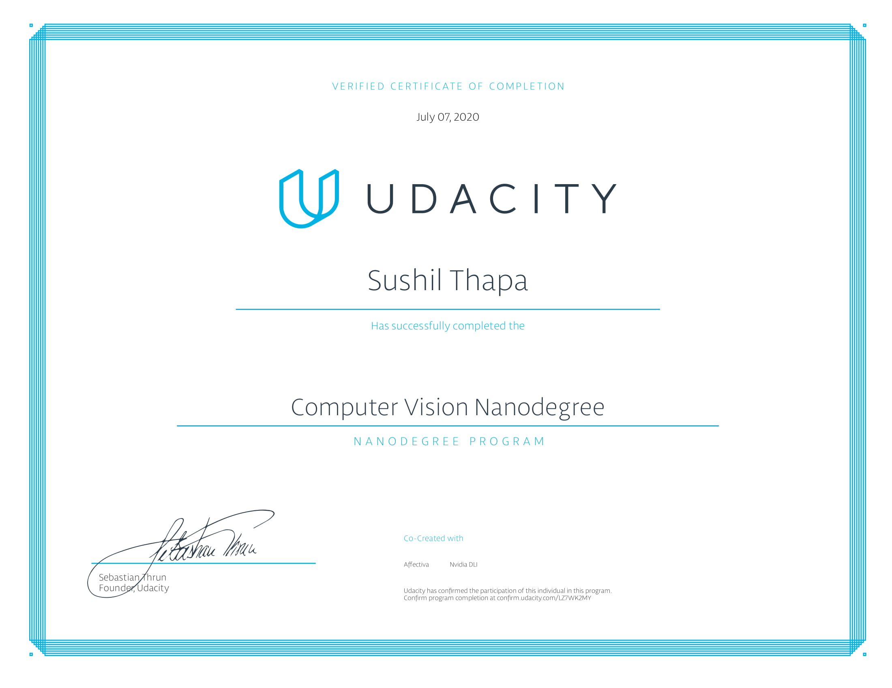

# Udacity-Computer-Vision-Nanodegree

### Program outline:
Covers the computer vision skills behind advances in robotics and automation. Write programs to analyze images, implement feature extraction, and recognize objects using deep learning models.

### 1. Introduction to Computer Vision
- Covers computer vision and image processing essentials. Learn to extract important features from image data, and apply deep learning techniques to classification tasks by building a convolutional neural network (CNN) using PyTorch.
-  Use image processing techniques and deep learning to recognize faces and facial keypoints, such as the location of the eyes and mouth on a face.

### 2. Advanced Computer Vision and Deep Learning
- Apply deep learning architectures to computer vision tasks. Discover how to combine CNN and RNN networks to build an automatic image captioning application.
-  Combine CNN and RNN knowledge to build a network that automatically produces captions, given an input image.

### 3- Object Tracking and Localization
- Covers how to locate an object and track it over time. These techniques are used in a variety of moving systems, such as self-driving car navigation and drone flight.
-  Use sensor data to localize a robot and build a map of the environment with SLAM.

**Nanodegree Link:**
> https://www.udacity.com/course/computer-vision-nanodegree--nd891

## Computer Vision Nanodegree Certificate

